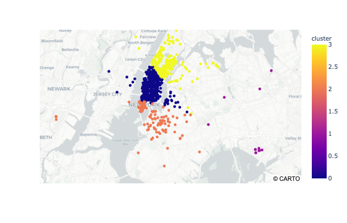

pip install -r requirements.txt

pip3 install -r requirements.txt

# PROJECTS Unsupervised Machine Learning

# Uber Pickups

300 min

# UBER Pickups

## Company's Description 📇

[Uber](http://uber.com/) is one of the most famous startup in the world. It started as a ride-sharing application for people who couldn't afford a taxi. Now, Uber expanded its activities to Food Delivery with [Uber Eats](https://www.ubereats.com/fr-en), package delivery, freight transportation and even urban transportation with [Jump Bike](https://www.uber.com/fr/en/ride/uber-bike/) and [Lime ](https://www.li.me/)that the company funded.The company's goal is to revolutionize transportation accross the globe. It operates now on about 70 countries and 900 cities and generates over $14 billion revenue! 😮

## Project 🚧

One of the main pain point that Uber's team found is that sometimes drivers are not around when users need them. For example, a user might be in San Francisco's Financial District whereas Uber drivers are looking for customers in Castro.

(If you are not familiar with the bay area, check out [Google Maps](https://www.google.com/maps/place/San+Francisco,+CA,+USA/@37.7515389,-122.4567213,13.43z/data=!4m5!3m4!1s0x80859a6d00690021:0x4a501367f076adff!8m2!3d37.7749295!4d-122.4194155))

Eventhough both neighborhood are not that far away, users would still have to wait 10 to 15 minutes before being picked-up, which is too long. Uber's research shows that users accept to wait 5-7 minutes, otherwise they would cancel their ride.

Therefore, Uber's data team would like to work on a project where **their app would recommend hot-zones in major cities to be in at any given time of day.**

## Goals 🎯

Uber already has data about pickups in major cities. Your objective is to create algorithms that will determine where are the hot-zones that drivers should be in. Therefore you will:

* Create an algorithm to find hot zones
* Visualize results on a nice dashboard

## Scope of this project 🖼️

To start off, Uber wants to try this feature in New York city. Therefore you will only focus on this city. Data can be found here:

👉👉[ Uber Trip Data](https://full-stack-bigdata-datasets.s3.eu-west-3.amazonaws.com/Machine+Learning+non+Supervis%C3%A9/Projects/uber-trip-data.zip) 👈👈

**You only need to focus on New York City for this project**

## Helpers 🦮

To help you achieve this project, here are a few tips that should help you:

### Clustering is your friend

Clustering technics are a perfect fit for the job. Think about it, all the pickup locations can be gathered into different clusters. You can then use **cluster coordinates to pin hot zones** 😉

### Create maps with `plotly`

Check out [Plotly](https://plotly.com/) documentation, you can create maps and populate them easily. Obviously, there are other libraries but this one should do the job pretty well.

### Start small grow big

Eventhough Uber wants to have hot-zones per hour and per day of week, you should first  **start small** . Pick one day at a given hour and **then start to generalize** your approach.

## Deliverable 📬

To complete this project, your team should:

* Have a map with hot-zones using any python library (`plotly` or anything else).
* You should **at least** describe hot-zones per day of week.
* Compare results with **at least** two unsupervised algorithms like KMeans and DBScan.

Your maps should look something like this:

### Uber trip data from 2014

There are six files of raw data on Uber pickups in New York City from April to September 2014. The files are separated by month and each has the following columns:

* `Date/Time` : The date and time of the Uber pickup
* `Lat` : The latitude of the Uber pickup
* `Lon` : The longitude of the Uber pickup
* `Base` : The [TLC base company](http://www.nyc.gov/html/tlc/html/industry/base_and_business.shtml) code affiliated with the Uber pickup

These files are named:

* `uber-raw-data-apr14.csv`
* `uber-raw-data-aug14.csv`
* `uber-raw-data-jul14.csv`
* `uber-raw-data-jun14.csv`
* `uber-raw-data-may14.csv`
* `uber-raw-data-sep14.csv`

### Uber trip data from 2015

Also included is the file `uber-raw-data-janjune-15.csv` This file has the following columns:

* `Dispatching_base_num` : The [TLC base company](http://www.nyc.gov/html/tlc/html/industry/base_and_business.shtml) code of the base that dispatched the Uber
* `Pickup_date` : The date and time of the Uber pickup
* `Affiliated_base_num` : The [TLC base company](http://www.nyc.gov/html/tlc/html/industry/base_and_business.shtml) code affiliated with the Uber pickup
* `locationID` : The pickup location ID affiliated with the Uber pickup

The `Base` codes are for the following Uber bases:

B02512 : Unter
B02598 : Hinter
B02617 : Weiter
B02682 : Schmecken
B02764 : Danach-NY
B02765 : Grun
B02835 : Dreist
B02836 : Drinnen

For coarse-grained location information from these pickups, the file `taxi-zone-lookup.csv` shows the taxi `Zone` (essentially, neighborhood) and `Borough` for each `locationID`.
